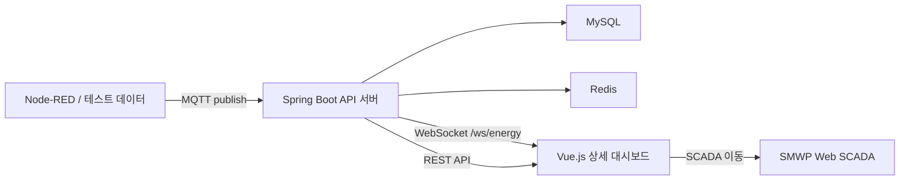

# 생성형 AI 기반 ESG 에너지 분석 평가 플랫폼 최종 보고서 초안

## 1. 프로젝트 개요

본 프로젝트는 현대자동차 울산·아산·전주 공장과 기아 광명·화성·광주 공장을 대상으로 전력, 가스, 용수, 태양광 발전 데이터를 통합 관제하고 ESG 관점의 에너지 운영 상태를 분석하는 제조 DX 플랫폼 구축을 목표로 한다. 기존 수행계획서에서 제시한 “다사업장 에너지 데이터 통합, 피크 전력 관리, ESG 자체 평가, 개선 시뮬레이션, AI 챗봇 기반 설명” 방향을 유지하되, 구현 단계에서는 Spring Boot API, MySQL, MQTT, WebSocket, Vue.js 기반 상세 대시보드를 중심으로 기능을 구체화하였다.

최종보고서 초안 점검 기준일은 2026년 5월 18일 월요일이며, 본 초안은 수행계획서의 기획 내용을 현재 저장소 구현 상태에 맞게 갱신한 것이다.

## 2. 추진 배경 및 필요성

자동차 제조공장은 프레스, 차체·용접, 도장, 조립, 공조, 압축공기, 보일러, 세척·냉각 등 공정별 에너지 사용 특성이 크게 다르다. 사업장별로 생산 규모와 설비 구성이 다르기 때문에 전력 사용량, 가스 사용량, 용수 사용량, 태양광 발전량을 개별적으로 관리하면 전체 운영 효율과 ESG 개선 우선순위를 빠르게 판단하기 어렵다.

특히 생산 시작, 교대 전환, 대형 설비 동시 기동, 도장 공정 가동 시점에는 피크 전력이 발생할 가능성이 높다. 피크 전력 관리를 실패하면 순간 전력 증가를 넘어 전력 기본요금 상승과 운영비 증가로 이어질 수 있으므로, 실시간 관제와 기준 대비 초과 여부 확인이 필요하다.

따라서 본 프로젝트는 엑셀 기반 사후 취합 중심의 ESG 대응을 데이터 기반 실시간 관제와 자동 집계, 사업장별 비교, 원인 분석, 개선 시뮬레이션 중심으로 전환하는 데 목적이 있다.

## 3. 수행계획 대비 구현 방향

수행계획서에서는 Node-RED 테스트 데이터, Spring Boot API, Redis, MySQL, SMWP Web SCADA UI로 이어지는 구조를 제안하였다. 현재 구현에서는 Node-RED 또는 테스트 데이터 생성부에서 MQTT 메시지를 발행하고, Spring Boot가 이를 구독하여 에너지 계측 데이터를 수신하는 방식으로 구체화하였다.

수신된 계측 데이터는 MySQL 기반 이력 데이터로 저장되며, 일별·월별 집계 배치가 구현되어 기간별 조회와 대시보드 분석에 활용된다. 실시간 화면 반영을 위해 WebSocket `/ws/energy`가 구성되어 에너지 계측 메시지를 프론트엔드로 전달한다. Redis는 현재 인증 refresh token 저장과 RedisTemplate 설정이 반영되어 있으며, 계획서상 최신 계측값 캐시·최근 사용량 임시 저장 용도는 최종 점검 및 고도화 항목으로 남아 있다.

프론트엔드는 수행계획서의 SMWP 화면 흐름을 유지하면서, Vue.js 기반 상세 관제 화면을 추가하였다. 로그인 후 기본 SCADA 화면은 SMWP 외부 관제 URL로 연결되며, 설비 조회, 피크 전력, 가스·용수, ESG 평가, 사용자 관리, 알람 관리는 Vue 상세 화면에서 API와 연동해 조회할 수 있도록 구성되어 있다.

## 4. 시스템 구성

### 4.1 간소화된 시스템 구성도

### 4.2 주요 구성 요소

| 구분 | 적용 기술 | 역할 |
| --- | --- | --- |
| 데이터 수집 | Node-RED, MQTT | 6개 사업장·설비별 에너지 계측 데이터 생성 및 송신 |
| 백엔드 | Spring Boot 3, Java 17 | 인증, 사용자, 사업장, 설비, 에너지, 피크, ESG, 알람, 시뮬레이션, 챗봇 API 제공 |
| 데이터 저장 | MySQL, MyBatis | 계측 이력, 집계, 사용자, 사업장, 설비, 알람, ESG 점수, 시뮬레이션, 챗봇 이력 저장 |
| 실시간 처리 | MQTT inbound, WebSocket | 계측 메시지 수신 후 저장 및 실시간 화면 전파 |
| 캐시/토큰 | Redis | refresh token 관리, 향후 최신 계측값 캐시 확장 기반 |
| 화면 | SMWP, Vue.js, Vite | SCADA 화면 연결 및 상세 관제·관리 화면 제공 |
| 보안 | Spring Security, JWT | 로그인, 토큰 발급·갱신·로그아웃, 인증 사용자 기반 API 보호 |

## 5. 데이터 및 DB 설계

현재 저장소는 사업장, 설비, 에너지 계측값, 에너지 집계, ESG 점수, 알람, 개선 시뮬레이션, 챗봇 메시지, 사용자 정보를 중심으로 데이터를 구성한다.

주요 데이터 흐름은 다음과 같다.

1. Node-RED 또는 테스트 발행기가 사업장 ID, 설비 ID, 계측 시각, 전력 사용량, 가스 사용량, 용수 사용량, 태양광 발전량, 피크 전력 값을 MQTT로 발행한다.
2. Spring Boot MQTT subscriber가 메시지를 수신하여 `energy_measurements` 이력 테이블에 저장한다.
3. 일별·월별 집계 배치가 `energy_summaries` 데이터를 재계산한다.
4. 대시보드 API는 이력·집계 데이터를 기반으로 설비별 사용량, 피크 추이, 가스·용수 사용 패턴, ESG 점수와 등급을 조회한다.
5. 알람, 시뮬레이션, 챗봇 응답은 각각 별도 이력으로 저장하여 운영 추적이 가능하도록 한다.

데모 데이터는 6개 사업장과 사업장별 주요 설비, 2026년 5월 기준 에너지 계측·집계, ESG 점수, 알람, 시뮬레이션, 챗봇 메시지를 포함한다.

## 6. 화면 설계 업데이트

### 6.1 전체 화면 구조

수행계획서의 화면 범위인 로그인, 메인, 에너지 종합, 설비 사용량, 피크 전력, 가스·용수, ESG 평가, 사용자 관리를 유지하면서, 현재 구현에서는 다음과 같이 화면을 정리하였다.

| 화면 | 현재 설계 | 주요 기능 |
| --- | --- | --- |
| 로그인 | Vue 로그인 화면 | 이메일·비밀번호 로그인, JWT 저장, 로그아웃 |
| SCADA 메인 | SMWP 외부 화면 연결 | 기존 SCADA 화면으로 이동하여 현장 관제 화면 확인 |
| 설비 조회 | Vue 상세 화면 | 사업장·설비·에너지원·기간 필터, 설비 상태, 사용량 차트, 최근 계측값 |
| 피크 전력 | Vue 상세 화면 | 기준 피크 대비 현재 피크, 15분 평균·최대 추이, 설비별 전력 사용 순위, 피크 이력 |
| 가스·용수 | Vue 상세 화면 | 금일 사용량, 전일 대비 증감률, 시간대별 사용량, 계측기 통신 상태, 최근 7일 패턴 |
| ESG 평가 | Vue 상세 화면 | 6개 사업장 ESG 등급 지도, 등급 순위, 항목별 점수 비교, 탄소·용수·태양광·피크 세부 분석 |
| 사용자 관리 | Vue 상세 화면 | 사용자 목록, 역할, 사업장, 계정 상태, 최근 로그인 정보 |
| 알람 관리 | Vue 상세 화면 | 알람 목록, 등급, 발생 시각, 기준값, 처리 상태, 알람 처리 |

### 6.2 화면 설계 변경 포인트

기존 수행계획서는 SMWP 중심 화면 구성을 제시했으나, 현재 구현에서는 SMWP를 메인 관제 화면으로 연결하고 Vue.js를 API 연동형 상세 대시보드로 사용하는 혼합 구조로 정리하였다. 이를 통해 SCADA 관제 화면과 웹 기반 분석 화면을 분리하여 구현 속도를 높이고, 피크·가스·용수·ESG처럼 표와 차트가 많은 화면은 Vue에서 유연하게 확장할 수 있도록 하였다.

설비 조회 화면은 단순 현황 조회에서 사업장, 설비, 에너지원, 조회 기간을 조합하는 상세 분석 화면으로 확장되었다. 피크 전력 화면은 기준 피크 대비 사용률과 15분 단위 추이를 중심으로 구성되었으며, 가스·용수 화면은 계측기 통신 상태와 최근 사용 패턴을 함께 표시하도록 보강되었다. ESG 화면은 수행계획서의 6개 사업장 등급 지도 개념을 반영하여 사업장별 등급, 순위, 항목별 점수, 운영 알림, 점수 산정 로직을 한 화면에서 확인할 수 있게 구성하였다.

## 7. 주요 기능 구현 결과

### 7.1 인증 및 사용자 관리

Spring Security와 JWT 기반 인증을 적용하였다. 로그인 성공 시 access token과 refresh token을 발급하며, refresh token은 Redis에 저장해 갱신과 로그아웃 처리를 지원한다. 사용자 API는 현재 로그인 사용자 조회, 사용자 목록 조회, 사용자 상세 조회, 사용자 정보 수정 기능을 제공한다.

### 7.2 사업장 및 설비 관리

현대·기아 6개 사업장을 기준으로 사업장 목록과 단건 조회 API를 제공한다. 각 사업장에는 프레스, 차체, 도장, 조립, 공조, 검사 등 자동차 제조공정 설비가 연결되며, 설비 상태는 운영, 경고, 정지, 점검 상태로 관리된다.

### 7.3 에너지 계측 및 집계

에너지 계측값은 전력 kWh, 가스 m3, 용수 ton, 태양광 kWh, 피크 kW, 계측 시각을 포함한다. MQTT 수신 서비스는 계측 메시지를 파싱하여 이력 데이터로 저장하고, WebSocket을 통해 실시간 대시보드에 전달한다. 일별·월별 집계 배치는 기존 집계를 삭제 후 재생성하는 방식으로 재계산 가능성을 확보하였다.

### 7.4 설비별 에너지 조회

사업장, 설비, 에너지원, 기간을 기준으로 설비 상세 사용량을 조회한다. 일자별 사용량 차트, 오늘 사용량, 전일 대비 증감량과 증감률, 최근 로그를 제공하여 특정 설비의 과다 사용 구간을 확인할 수 있다.

### 7.5 피크 전력 모니터링

피크 전력 화면은 현재 피크 kW, 기준 피크 대비 사용률, 15분 평균·최대 전력, 설비별 사용량 순위, 피크 초과 이력을 제공한다. 기준 피크는 설비 수와 설비별 기준 피크를 기반으로 계산하여 사업장 규모 차이를 반영한다.

### 7.6 가스·용수 모니터링

가스·용수 화면은 금일 사용량, 누적량, 전일 대비 증감률, 시간대별 사용량, 계측기별 최신값과 통신 상태, 최근 7일 사용 패턴을 제공한다. 전기 중심의 관제에서 벗어나 수행계획서에서 요구한 복합 에너지 관제를 반영하였다.

### 7.7 ESG 평가 지표

ESG 평가는 외부 공식 인증 점수를 대체하는 것이 아니라 사업장별 에너지 효율 상태를 비교하기 위한 자체 평가 지표로 구현하였다. 탄소배출, 용수 사용, 태양광 활용, 피크 전력, 전력·가스 효율을 0~10점으로 정규화하고 가중합으로 종합 점수와 등급을 산정한다.

현재 구현 기준 가중치는 탄소 30%, 용수 20%, 태양광 20%, 피크 20%, 전력·가스 효율 10%이다. 등급은 AAA, AA, A, BBB, BB, B, CCC로 구분하며, 6개 사업장의 순위와 항목별 점수를 비교할 수 있다.

### 7.8 개선 시뮬레이션

개선 시뮬레이션 API는 전력 절감률, 가스 절감률, 용수 절감률, 피크 저감률, 태양광 증가율을 입력받아 예상 ESG 점수와 등급 변화를 계산한다. 시뮬레이션 결과는 사용자와 사업장 기준으로 저장되어 최근 실행 이력을 조회할 수 있다.

### 7.9 AI 챗봇

챗봇 API는 사용자의 질문을 저장하고, 선택 사업장의 최신 에너지 집계와 ESG 점수를 참조해 응답을 생성한다. 현재 구현은 생성형 AI 모델 직접 연동 전 단계로, 정량 데이터 기반 요약 응답과 참조 데이터 저장 구조가 마련되어 있다. 향후 OpenAI 등 생성형 AI 연동 시 계산은 백엔드 API에서 수행하고, AI는 결과를 자연어로 설명하는 구조로 확장할 수 있다.

### 7.10 알람 관리

알람 API는 사업장, 상태, 등급별 알람 목록 조회를 지원하며, 발생 알람을 처리 완료 상태로 변경할 수 있다. 피크 초과, 설비 이상, 가스·용수 이상, ESG 알림 등 운영 이벤트를 통합 관리할 수 있도록 설계하였다.

## 8. API 구성 요약

| 영역 | 주요 API |
| --- | --- |
| 인증 | `POST /api/auth/signup`, `POST /api/auth/login`, `POST /api/auth/refresh`, `POST /api/auth/logout` |
| 사용자 | `GET /api/users/me`, `GET /api/users`, `GET /api/users/{userId}`, `PATCH /api/users/{userId}` |
| 사업장/설비 | `GET /api/plants`, `GET /api/plants/{plantId}`, `GET /api/plants/{plantId}/facilities`, `GET /api/facilities/{facilityId}` |
| 대시보드 | `GET /api/dashboard/overview` |
| 에너지 | `GET /api/energy/measurements`, `GET /api/energy/summaries`, `GET /api/energy/facility-detail`, `GET /api/energy/latest/plants/{plantId}/facilities/{facilityId}` |
| 피크/유틸리티 | `GET /api/energy/peak-dashboard`, `GET /api/energy/utility-dashboard` |
| ESG | `GET /api/esg/scores`, `GET /api/esg/scores/plants/{plantId}/latest`, `GET /api/esg/environment-dashboard` |
| 시뮬레이션 | `POST /api/simulations`, `GET /api/simulations` |
| 챗봇 | `POST /api/chatbot/messages`, `GET /api/chatbot/messages` |
| 알람 | `GET /api/alarms`, `PATCH /api/alarms/{alarmId}/resolve` |
| 실시간 | `WebSocket /ws/energy` |

## 9. 테스트 및 검증 현황

백엔드에는 Spring Boot 컨텍스트 테스트, Swagger 설정 테스트, Security 설정 테스트, JWT 토큰 테스트, 인증 서비스 테스트, refresh token 서비스 테스트, 인증 컨트롤러 테스트, 사용자 서비스·컨트롤러 테스트가 포함되어 있다. 이를 통해 인증 흐름, 토큰 발급·검증, 사용자 조회·수정 권한, 공통 보안 설정을 중심으로 단위 및 웹 계층 검증을 수행할 수 있다.

다만 에너지, 피크, 가스·용수, ESG, 시뮬레이션, 챗봇, 알람 기능은 현재 구현은 존재하지만 테스트 커버리지가 인증·사용자 영역에 비해 부족하다. 최종 보고서 제출 전에는 핵심 대시보드 API와 ESG 산정 로직에 대한 테스트를 추가하고, 데모 데이터 적재 후 API 응답과 화면 표시값이 일치하는지 통합 점검이 필요하다.

## 10. 수행 결과 및 기대 효과

본 프로젝트를 통해 6개 사업장의 에너지 데이터를 단일 구조로 조회하고, 사업장·설비·에너지원 단위로 사용량을 비교할 수 있는 기반을 마련하였다. 전력뿐 아니라 가스, 용수, 태양광 데이터를 함께 제공함으로써 ESG 관점의 복합 에너지 관제가 가능해졌다.

피크 전력 화면은 기준 대비 현재 사용률과 15분 단위 추이를 제공하여 위험 구간을 조기에 파악할 수 있게 한다. ESG 평가는 탄소, 용수, 태양광, 피크, 전력·가스 효율을 점수화하여 사업장별 등급과 개선 우선순위를 판단하는 기준을 제공한다. 개선 시뮬레이션과 챗봇 구조는 운영자가 단순 수치 확인을 넘어 “무엇을 개선해야 하는지”를 설명받고 의사결정할 수 있는 방향으로 확장 가능하다.

## 11. 최종 점검 및 보완 예정 사항

1. 데이터베이스 초기화 스크립트 정합성 점검이 필요하다. 현재 `database/init.sql`은 사용자 테이블 중심으로 구성되어 있고, 데모 데이터는 여러 도메인 테이블을 전제로 하므로 전체 테이블 생성 DDL 정리가 필요하다.
2. 일부 프론트엔드 및 데모 SQL의 한글 문자열이 인코딩 문제로 깨져 보이는 부분이 있어 최종 시연 전 UTF-8 기준으로 라벨과 데모 데이터를 정비해야 한다.
3. 계획서상 Redis 최신 계측값 캐시와 최근 사용량 임시 저장 구조는 아직 에너지 계측 저장 흐름에 직접 반영되지 않았으므로, Redis key 설계와 TTL 정책을 확정하고 구현 여부를 결정해야 한다.
4. 에너지, 피크, ESG, 시뮬레이션, 챗봇, 알람 API에 대한 단위 테스트와 통합 테스트를 보강해야 한다.
5. AI 챗봇은 현재 정량 데이터 기반 요약 응답 구조까지 구현되어 있으므로, 실제 생성형 AI 연동 범위와 비용·보안 정책을 확정해야 한다.
6. SMWP 화면과 Vue 상세 화면 간 이동 흐름, 시연 URL, 데모 계정, 데모 데이터 기준일을 최종 발표 시나리오와 맞춰 고정해야 한다.

## 12. 결론

본 프로젝트는 수행계획서에서 제시한 ESG 에너지 통합 관제 플랫폼의 핵심 방향을 바탕으로, Spring Boot 백엔드와 MySQL 데이터 저장, MQTT 계측 수집, WebSocket 실시간 전달, Vue.js 상세 대시보드를 구현하였다. 로그인과 사용자 관리, 사업장·설비 조회, 에너지 계측·집계, 피크 전력, 가스·용수, ESG 평가, 개선 시뮬레이션, 챗봇, 알람 관리 기능을 통해 제조사업장의 에너지 운영 상태를 데이터 기반으로 파악할 수 있는 구조를 마련하였다.

최종 단계에서는 DB DDL 정리, 한글 인코딩 정비, Redis 계측 캐시 적용 여부 결정, 주요 대시보드 API 테스트 보강, 생성형 AI 연동 범위 확정을 중심으로 품질을 높이면 발표 및 최종 보고서 완성도를 높일 수 있다.
